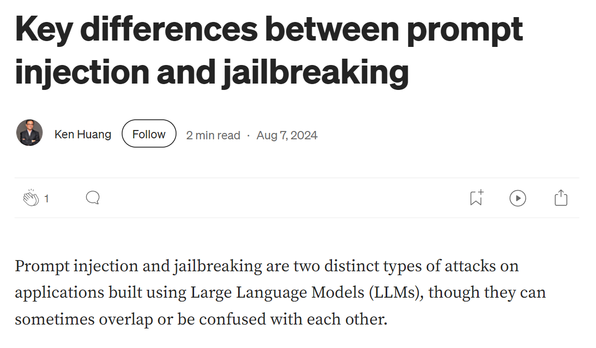
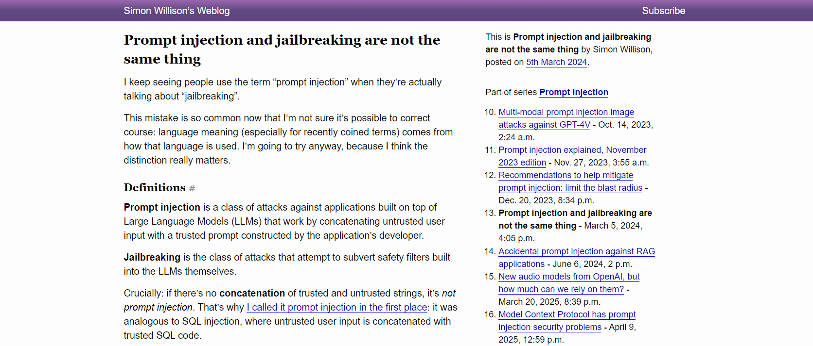
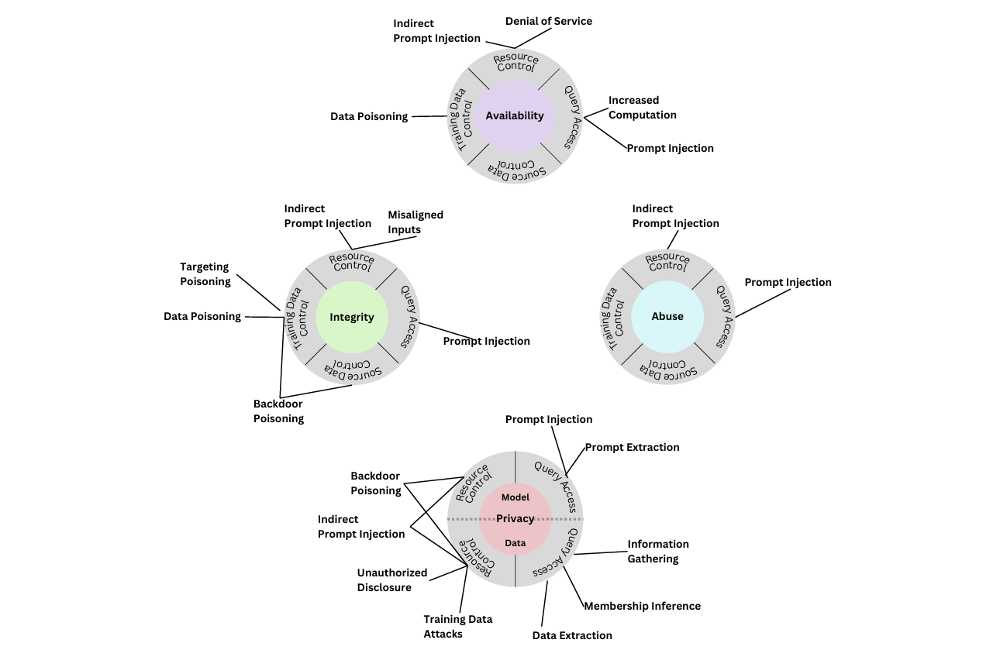
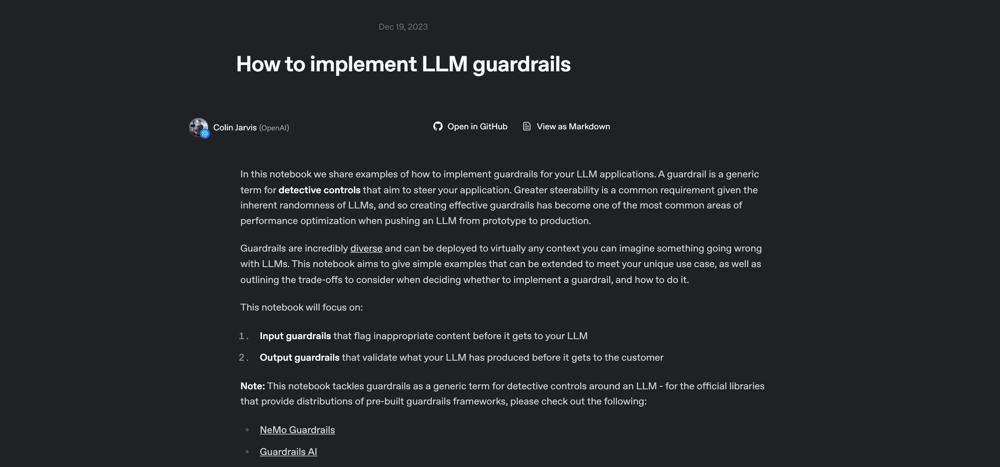

---
hide:
  - navigation
  - toc
---

# Resources

-   [   Key Differences Between Prompt Injection and Jailbreaking](https://kenhuangus.medium.com/key-differences-between-prompt-injection-and-jailbreaking-d397cffbe812)

-   [   Prompt Injection vs Jailbreaking: A Deeper Dive (Simon Willison)](https://simonwillison.net/2024/Mar/5/prompt-injection-jailbreaking/)

-   [   Inject My PDF (Kai Greshake)](https://kai-greshake.de/posts/inject-my-pdf/)

-   [   NIST AI Risk Management Framework (NIST.AI.100-2e2023)](https://nvlpubs.nist.gov/nistpubs/ai/NIST.AI.100-2e2023.pdf)

-   [   Understanding the RAG Architecture Model: A Deep Dive into Modern AI (Hamid Pirzada)](https://medium.com/@hamipirzada/understanding-the-rag-architecture-model-a-deep-dive-into-modern-ai-c81208afa391)

-   [   How to Use Guardrails (OpenAI Cookbook)](https://cookbook.openai.com/examples/how_to_use_guardrails)

- [-   Prompt Injection Using Emojis — Repello.ai](https://repello.ai/blog/prompt-injection-using-emojis)

- [   Emoji Unicode — ToolExe](https://toolexe.com/text/emoji-unicode)

- [   Emoji Jailbreaks — Google Cloud (Medium)](https://medium.com/google-cloud/emoji-jailbreaks-b3b5b295f38b)

- [   Prompting Guide — PromptingGuide.ai](https://www.promptingguide.ai/)

- [   Build an LLM-based Resume Analyzer — Mercity.ai](https://www.mercity.ai/blog-post/build-an-llm-based-resume-analyzer)

- [   Prompt Injection — LearnPrompting.org](https://learnprompting.org/docs/prompt_hacking/injection?srsltid=AfmBOoolBMDC5yCC7t_1G--Bwq3bEmZzf-qmSoPmQKkpx6uCr6zZQZln)

- [   What is a Prompt Injection Attack? — Palo Alto Networks Cyberpedia](https://www.paloaltonetworks.com/cyberpedia/what-is-a-prompt-injection-attack)

- [   20 Prompt Injection Techniques Every Red Teamer Should Test — fdzDev (Medium)](https://fdzdev.medium.com/20-prompt-injection-techniques-every-red-teamer-should-test-b22359bfd57d)

- <iframe width="900" height="300" src="https://www.youtube.com/embed/EsSQhZejsvs" title="You can Hack AI | Solve ALL Gandalf AI CTF Levels with SINGLE Prompt" frameborder="0" allow="accelerometer; autoplay; clipboard-write; encrypted-media; gyroscope; picture-in-picture; web-share" referrerpolicy="strict-origin-when-cross-origin" allowfullscreen></iframe>

- <iframe width="900" height="300" src="https://www.youtube.com/embed/LfQLfmRUWuI" title="LLM01: Prompt Injection | Prompt Injection via Emojis | AI Security Expert" frameborder="0" allow="accelerometer; autoplay; clipboard-write; encrypted-media; gyroscope; picture-in-picture; web-share" referrerpolicy="strict-origin-when-cross-origin" allowfullscreen></iframe>

